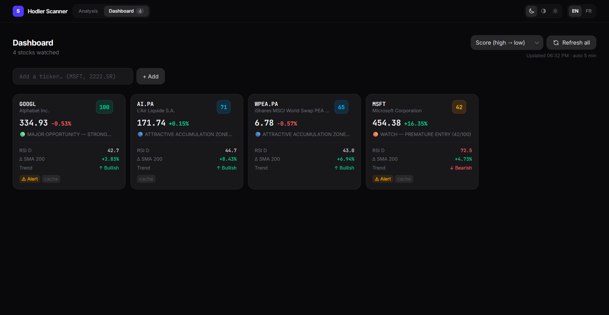
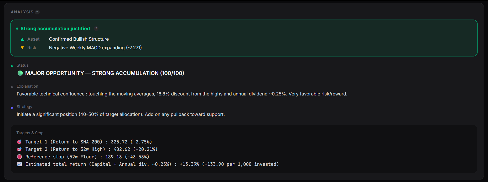
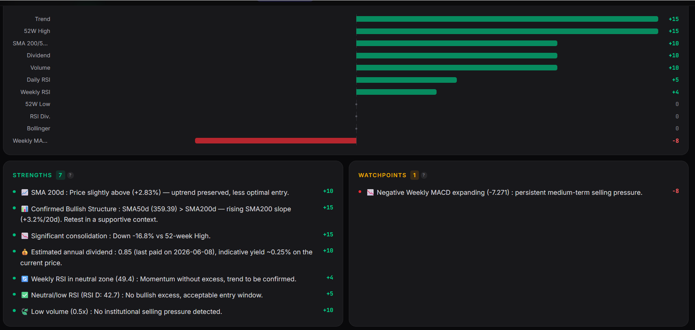
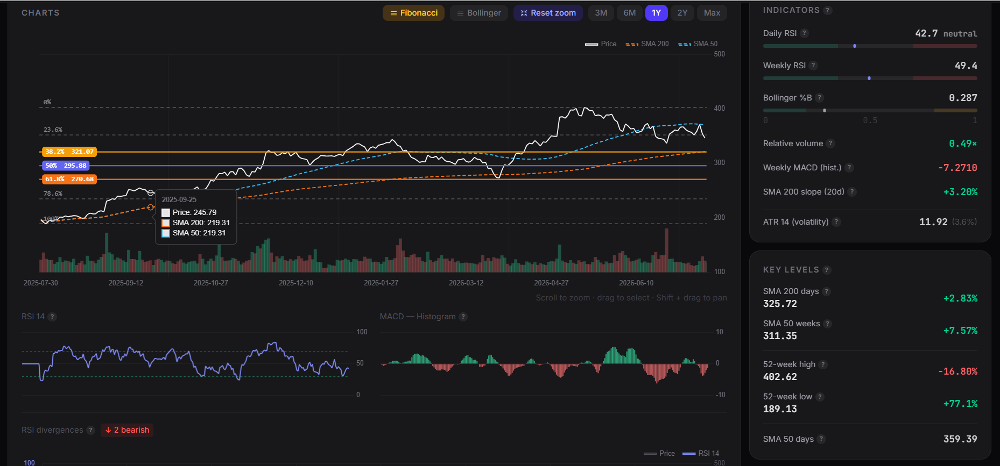

<div align="center">


# Hodler Scanner

### 💎 *Buy &amp; Hold* Technical Analysis

**Turn raw market data into an actionable accumulation score, a plain-language thesis and concrete price targets.**

<p>
  
  
  
  
  
  
  
  
  
</p>

<p>
  
  
  
  
</p>

</div>

> 🔭 A **long-term** stock-opportunity scanner that turns raw market data into an **actionable accumulation score (0–100)**, a plain-language investment thesis and concrete price targets.

The project couples a **quantitative analysis engine in Python** (vectorized `pandas`/`numpy` indicators, `yfinance` data) with a **FastAPI REST API** and a rich **Vue 3 interface** (interactive Chart.js charts, light/dark theme, watchlist, educational tooltips, full **English / French** localization).

---

> [!CAUTION]
> ## ⚠️ DISCLAIMER — NOT FINANCIAL ADVICE
>
> Hodler Scanner is provided **strictly for educational and informational purposes only**. It does **NOT constitute investment, financial, legal or tax advice**, nor any recommendation to buy or sell a security.
>
> - 📉 The analyses rely on historical data and technical heuristics that **guarantee no future outcome** — *past performance is not indicative of future results*.
> - 🚫 The author accepts **no responsibility or liability** for any loss or damage arising from the use of this tool.
> - 🔎 **Always do your own research** and **consult a licensed financial advisor** before making any investment decision.
>
> _By using this project, you acknowledge that you do so entirely at your own risk._

---

## 📋 Table of contents

1. [Investment philosophy](#-investment-philosophy)
2. [Features](#-features)
3. [Screenshots](#-screenshots)
4. [Architecture](#-architecture)
5. [Tech stack](#-tech-stack)
6. [The financial analysis engine](#-the-financial-analysis-engine)
   - [Technical indicators](#technical-indicators)
   - [The scoring system](#the-scoring-system-0100)
   - [Statuses & recommendations](#statuses--recommendations)
   - [Price targets & estimated return](#price-targets--estimated-return)
7. [Internationalization (i18n)](#-internationalization-i18n)
8. [REST API](#-rest-api)
9. [Frontend](#-frontend)
10. [Installation & deployment](#-installation--deployment)
11. [Configuration](#-configuration)
12. [Caching strategy](#-caching-strategy)
13. [Command-line usage](#-command-line-usage-cli)

---

## 🎯 Investment philosophy

Hodler Scanner is **not** a short-term *trading* tool. It is built for the **Buy & Hold** investor who wants to **accumulate quality companies at the right time** — that is, during **technical pullbacks onto major supports**, rather than in the middle of euphoria near the highs.

The underlying logic rests on three pillars:

| Pillar | Principle | Indicators used |
|--------|-----------|-----------------|
| **Underlying trend** | Favor names whose long-term structure remains healthy (no "falling knife"). | SMA 200d, SMA 50w, SMA 200 slope, crossovers |
| **Discount / timing** | Reward buying on a **pullback** onto support and penalize buying at the top. | Distance to 52-week high / low, Bollinger %B, RSI |
| **Reversal momentum** | Detect the **exhaustion of selling pressure** that precedes a rebound. | Weekly/daily RSI, RSI divergences, weekly MACD, relative volume |

The result is condensed into a **single opportunity score**, transparently broken down so that every point gained or lost is traceable.

---

## ✨ Features

- 🔍 **Full single-ticker analysis** in JSON (price, ~15 indicators, distances, signals, scoring, targets).
- 🧮 **0–100 accumulation scoring** with a **signed contribution** per category (Strengths / Watchpoints bar chart).
- 🗂️ **Batch analysis** (up to 50 tickers in parallel).
- 📊 **Interactive charts**: price + SMA 200/50, volume, **Fibonacci levels**, **Bollinger bands** (togglable), RSI 14 and MACD histogram sub-charts, plus an annotated **price/RSI divergence** detector.
- 🗂️ **Tabbed analysis view** — a pinned **decision core** (opportunity score + entry-timing) stays visible while the rest is split into tabs (**Charts / Score / Analysis / Backtest / Context**) for progressive disclosure; the active tab is persisted and each panel mounts on demand so charts always size correctly.
- ↕️ **Dashboard sorting** — sort the watchlist by score (highest first by default), change, or name.
- ⌨️ **Quick-search modal** — `Ctrl/⌘ K` (or `/`) opens a command-palette search (name / symbol / **ISIN**) from anywhere in the app, with full keyboard navigation (↑↓ / ↵ / esc) and a focus trap.
- ♿ **Accessible, low-jank UI** — skeleton loaders that mirror the final layout (fast perceived load, no layout shift), inline “unavailable” states instead of silently hiding failed sections, and full **`prefers-reduced-motion`** support.
- 📰 **Recent news feed** per ticker (Yahoo Finance headlines with publisher, date and thumbnail).
- 🔄 **Forced refresh** (cache bypass) per ticker.
- 🧪 **Score backtest with a plain-language verdict** — replays the exact scoring engine over **up to ~10 years** of history and shows realized forward returns (**3M / 6M / 12M**) grouped by score band, each measured **against a buy-anytime baseline**. A **verdict banner** states, per ticker and horizon, whether buying on high scores actually **beat buying at a random time** (the real signal — *being positive isn't enough, it must beat the baseline*), alongside a **color-coded score-vs-price timeline** and a score/return correlation.
- 📈 **Score history distribution** — a histogram of the ticker's own ~10-year score range showing where **today's score sits versus its past** (current bin highlighted, percentile, min / median / max).
- 🎛️ **Strategy backtest** — a weekly simulation that stays invested only while the score is above an **adjustable threshold** (otherwise in cash) versus staying fully invested, with an **equity curve**, CAGR, **max drawdown**, exposure and switch count, plus a verdict on whether score-timing beat buy &amp; hold on that stock.
- 💼 **Portfolio tracking** — add positions with an **autocomplete ticker search** (name / symbol / ISIN, same engine as the rest of the app), record quantity, average cost and a note, get **live valuation, P&amp;L, and allocation weights**, and jump to full analysis from any holding; persisted server-side in SQLite.
- 🧹 **Data reset (maintenance)** — a confirmation modal with **per-type toggles** (caches, backtest scores, watchlist, portfolio, ticker names) to selectively clear in-memory caches and database rows, with clearly flagged irreversible user-data options.
- ⭐ **Persisted watchlist** (localStorage front-side + SQLite server-side) + search history.
- 🌗 **Light / dark theme** with dynamic chart re-coloring.
- 🌍 **Full English / French localization** — both the UI and the backend-generated analysis text, with the choice persisted in localStorage.
- 💡 **Structured educational tooltips** (plain-language definition, formula, interpretation scale, tip) on every indicator.
- ⚡ **Cache pre-warming** at startup on a configurable ticker list.
- 📚 **Auto-generated Swagger UI** (`/docs`).

---

## 🖼️ Screenshots

<div align="center">

| Dashboard | Ticker analysis |
|:---------:|:---------------:|
|  |  |

| Score breakdown | Interactive charts |
|:---------------:|:------------------:|
|  |  |

</div>

---

## 🏗️ Architecture

```mermaid
flowchart LR
    subgraph Client["🖥️ Browser"]
        VUE["Vue 3 SPA<br/>Chart.js · Tailwind v4"]
    end

    subgraph Server["🐍 FastAPI container (uvicorn :8000)"]
        API["REST API<br/>backend/api.py (routes only)"]
        CACHE["TTL caches<br/>backend/cache.py"]
        ENGINE["Business logic<br/>backend/analysis.py · charts.py<br/>fundamentals.py · news.py · search.py<br/>market_data.py · script.py"]
        I18N["Language files<br/>backend/i18n.py · backend/locales/*.json"]
        DB[("SQLite<br/>backend/db.py<br/>watchlist · portfolio · name cache")]
        STATIC["Static SPA mounted on /"]
    end

    YF[("Yahoo Finance<br/>via yfinance")]
    VOL[["💾 ./data volume<br/>hodler.db"]]

    VUE -- \"GET /ticker/… /chart /fundamentals /news\" --> API
    VUE -- \"GET/PUT/POST/DELETE /favorites\" --> API
    VUE -- \"GET/PUT/DELETE /portfolio\" --> API
    VUE -- \"POST /reset\" --> API
    API --> CACHE
    API --> I18N
    API -- "favorites · portfolio · ticker names" --> DB
    DB -. "persisted" .-> VOL
    CACHE -- "miss" --> ENGINE
    ENGINE -- "download OHLCV + dividends" --> YF
    API --> STATIC
    STATIC --> VUE
```

Two frontend serving modes are provided:

- **Production (single image)** — the multi-stage `Dockerfile` builds the SPA (`node:24`) then copies it into `/app/static`, served directly by FastAPI (`StaticFiles`, mounted last so it does not shadow the API routes).
- **Nginx alternative** — `frontend/Dockerfile` + `nginx.conf` serve the SPA behind Nginx, which *proxies* the `/ticker|/health|/cache|/docs` routes to the API container.
- **Persistence** — a lightweight **SQLite** database (`backend/db.py`) stores the **favorites (watchlist)**, the **portfolio positions** and a memoized **`TICKER = Name`** cache, kept on the `./data` volume (`DB_PATH`, default `/app/data/hodler.db`).

---

## 🧰 Tech stack

| Layer | Technologies |
|-------|--------------|
| 📥 **Data** | [`yfinance`](https://github.com/ranaroussi/yfinance) (OHLCV + dividends, 500 sessions) |
| 🧮 **Compute** | Python 3.14, `pandas ≥ 3.0`, `numpy ≥ 2.5` (vectorized indicators) |
| 🌐 **API** | FastAPI ≥ 0.140, Uvicorn (ASGI), Pydantic v2 (response schemas), `cachetools` (TTL caches) |
| 🌍 **i18n** | Backend JSON language files (`backend/locales/en.json`, `backend/locales/fr.json`) loaded by `backend/i18n.py` |
| 🖼️ **Frontend** | Vue 3.5 + **TypeScript**, Vite 8, Tailwind CSS v4, Chart.js 4.5 + `chartjs-plugin-zoom` (tree-shaken, lazy-loaded), TanStack Vue Query, VueUse, `ofetch`; API types generated from the backend OpenAPI via `openapi-typescript` |
| 🐳 **Containerization** | Docker multi-stage, Docker Compose |

---

## 🔬 The financial analysis engine

The backend is split into a **thin routing layer** ([`backend/api.py`](backend/api.py), FastAPI routes only) and dedicated **business-logic modules**: `analysis.py` (technical analysis), `charts.py`, `fundamentals.py`, `news.py`, `search.py`, `market_data.py` (yfinance downloads), `cache.py` (TTL caches) and `serialization.py`. Response shapes are declared as **Pydantic v2 models** in [`backend/schemas.py`](backend/schemas.py) (documented in the OpenAPI schema), which [`backend/export_openapi.py`](backend/export_openapi.py) dumps to `backend/openapi.json` — the single source of truth for the frontend's generated TypeScript types.

The scoring intelligence lives in [`backend/script.py`](backend/script.py) — in particular the `generer_analyse_investisseur_lt(item, lang)` function. Indicators are pre-computed in `analyse_ticker()` of [`backend/analysis.py`](backend/analysis.py) from **500 daily sessions** (auto_adjust disabled, dividends included).

### Technical indicators

| Indicator | Computation | Role in the analysis |
|-----------|-------------|----------------------|
| **RSI 14 (daily)** | **Wilder** smoothing (`EMA α = 1/14`), TradingView-compatible | Short-term momentum: oversold (< 30) / overbought (> 70) |
| **RSI 14 (weekly)** | Same on `W-FRI` resampled closes | Underlying momentum, more reliable for *Buy & Hold* |
| **SMA 200 days** | Simple moving average | Ultimate long-term trend reference |
| **SMA 50 days** | Simple moving average | Intermediate trend (Golden/Death Cross) |
| **SMA 50 weeks** | ≈ 250 sessions, on a weekly basis | Major institutional support |
| **SMA 200 slope** | % change over 20 sessions | Direction of the underlying trend |
| **Weekly MACD** | EMA(12) − EMA(26), EMA(9) signal, histogram | Medium-term momentum reversal |
| **Bollinger %B** | `(price − lower band) / (4σ)` over 20d, ±2σ | Position within volatility (compression / expansion) |
| **ATR 14** | Average *True Range* over 14d | Volatility amplitude (position sizing) |
| **RVOL** | Today's volume ÷ 20-day volume SMA | Detects institutional pressure |
| **52-week high / low** | Rolling max / min over 252 sessions | Discount and Fibonacci anchors |
| **Bullish RSI divergence** | Detection of price *pivots* (Lower Low) vs RSI (Higher Low) over 80 sessions | Strong selling-exhaustion signal |

### The scoring system (0–100)

The score starts from a **neutral base of 40 points**, then each module adds or removes points via an `_add(category, text, impact)` helper. The total is **clamped to [0, 100]**. Each contribution is kept per category (`score_details`) and per diagnostic (signed `impact`), which feeds the **Strengths / Watchpoints** bars of the interface.

<details>
<summary><b>1 · SMA supports (200d / 50w confluence)</b></summary>

Confluence = price within a ±3% (SMA 200d) / ±3.5% (SMA 50w) band.

| Condition | Impact |
|-----------|:------:|
| **Double** confluence, retest **from below** (optimal zone) | **+35** |
| **Double** confluence, touching (to be confirmed) | +22 |
| SMA 200d confluence only, below / above | +20 / +10 |
| SMA 50w confluence only, below / above | +20 / +10 |
| Deep discount below both averages | +10 |
</details>

<details>
<summary><b>1b · Trend structure (SMA50 vs SMA200 + slope)</b></summary>

| Condition | Impact |
|-----------|:------:|
| SMA50 > SMA200 **and** slope > +0.5%/20d (confirmed bullish structure) | +15 |
| SMA50 > SMA200 (favorable structure) | +8 |
| SMA50 < SMA200 **and** slope < −0.5%/20d ("falling knife") | −15 |
| SMA50 < SMA200 (death cross) | −8 |
</details>

<details>
<summary><b>2 · Discount vs 52-week high</b></summary>

| Drawdown from the high | Impact |
|------------------------|:------:|
| ≤ −25% (major correction) | +25 |
| −25% to −15% | +15 |
| −15% to −8% | +5 |
| > −8% (near the highs, limited margin) | −15 |
</details>

<details>
<summary><b>2b · Proximity to the 52-week low</b></summary>

| Distance to the low | Impact |
|---------------------|:------:|
| ≤ +5% (potential capitulation zone) | +12 |
| ≤ +15% | +6 |
</details>

<details>
<summary><b>3 · Annual dividend</b></summary>

Dividend paid over the trailing 12 months > 0 → **+10** and computation of the **indicative yield** (`dividend / price`), fed back into the total-return estimate.
</details>

<details>
<summary><b>4 · Weekly RSI</b></summary>

| Weekly RSI | Impact |
|------------|:------:|
| ≤ 35 (pronounced oversold) | +20 |
| ≤ 45 (oversold) | +12 |
| ≤ 55 (neutral) | +4 |
</details>

<details>
<summary><b>5 · Daily RSI</b></summary>

| Daily RSI | Impact |
|-----------|:------:|
| ≤ 30 (extreme oversold) | +15 |
| ≤ 40 (oversold) | +10 |
| ≤ 50 (neutral/low) | +5 |
| ≥ 70 (overbought) | −10 |
</details>

<details>
<summary><b>6 · Relative volume (RVOL)</b></summary>

| RVOL | Impact |
|------|:------:|
| ≥ 2.0× (spike — selling pressure / event) | −10 |
| ≥ 1.3× (elevated activity) | 0 |
| < 0.8× (no selling pressure) | +10 |
</details>

<details>
<summary><b>7 · Bullish RSI divergence</b></summary>

Price at a *Lower Low* while the RSI forms a *Higher Low* over the last 80 sessions → **+18** (strong technical reversal signal).
</details>

<details>
<summary><b>8 · Bollinger %B</b></summary>

| %B | Impact |
|----|:------:|
| < 0 (below the lower band, extreme oversold) | +10 |
| < 0.2 (near the lower band) | +6 |
| > 1.0 (above the upper band, extension) | −6 |
| > 0.8 (near the upper band, resistance) | −3 |
</details>

<details>
<summary><b>9 · Weekly MACD</b></summary>

| Histogram configuration | Impact |
|-------------------------|:------:|
| Bullish crossover (turns positive) | +15 |
| Positive and expanding | +8 |
| Negative but narrowing | +4 |
| Negative and expanding | −8 |
</details>

### Statuses & recommendations

The final score is translated into a **readable status** paired with a contextual **DCA strategy**:

| Score | Status | Associated strategy |
|:-----:|--------|---------------------|
| **≥ 80** | 🟢 **Major opportunity — strong accumulation** | Initiate 40–50% of the target allocation, add on pullbacks |
| **60–79** | 🔵 **Attractive accumulation zone** | Gradual DCA (20–30%), wait for weekly confirmation |
| **40–59** | 🟠 **Watch — premature entry** | Price alert, wait for a pullback onto SMA 200d / 50w |
| **< 40** | 🔴 **Avoid — unfavorable setup** | Set aside, reassess after stabilization |

An **express synthesis** is generated for the header: `verdict` (action), `atout` (best strength) and `risque` (main watchpoint), automatically extracted from the diagnostics sorted by impact.

### Price targets & estimated return

The engine produces a conservative **1-year** trade plan:

- 🎯 **Target 1** — return to the **SMA 200d**
- 🎯 **Target 2** — return to the **52-week high**
- 🛑 **Reference stop** — the **52-week low**
- 📈 **Estimated total return** = `65% of the potential return to the 52-week high` **+** `annual dividend yield`, expressed as a gain per €1,000 invested.

> The **0.65** factor applies a caution discount: a full return to the high is not assumed.

---

## 🌍 Internationalization (i18n)

The app is fully bilingual (**English default**, **French**), covering both the interface and the backend-generated analysis text.

| Side | Mechanism |
|------|-----------|
| **Frontend** | The `useI18n` composable holds a message catalog with dot-path lookup and `{param}` interpolation. The locale is persisted in `localStorage` (`smm_locale`) and switching it re-fetches the analysis so the backend text is re-translated. |
| **Backend** | Translations live in external JSON language files [`backend/locales/en.json`](backend/locales/en.json) and [`backend/locales/fr.json`](backend/locales/fr.json), loaded and cached by [`backend/i18n.py`](backend/i18n.py) via `t(lang, key, **params)`. Templates use Python `str.format` placeholders (e.g. `{rsi_daily:.1f}`). English is the fallback for any missing key. |

The chosen language is sent to the API through the `lang` query parameter (`GET /ticker/{code}?lang=fr`) or the `lang` field of the batch request body. Adding a language is as simple as dropping a new `backend/locales/xx.json` file and registering the code.

---

## 🌐 REST API

Default base URL: `http://localhost:8000` — interactive documentation at **`/docs`**.

| Method | Route | Description |
|--------|-------|-------------|
| `GET` | `/health` | Availability check |
| `GET` | `/search?q=` | Search tickers by name / symbol |
| `GET` | `/ticker/{code}?lang=en` | Full technical analysis (`?refresh=true` to bypass cache) |
| `GET` | `/ticker/{code}/chart?period=1y` | Historical series (`3mo\|6mo\|1y\|2y\|max`, `?refresh=true`) |
| `GET` | `/ticker/{code}/fundamentals` | P/E, market cap, sector… (`?refresh=true`) |
| `GET` | `/ticker/{code}/news` | Recent news headlines for the stock (`?refresh=true`) |
| `GET` | `/ticker/{code}/backtest` | Light historical backtest of the score (`?refresh=true`) |
| `POST` | `/tickers` | Batch analysis (≤ 50 tickers, `{ "tickers": [...], "lang": "en", "refresh": false }`) |
| `GET` | `/cache` | Cache state (entries, age, remaining TTL) |
| `DELETE` | `/cache` | Clear the entire cache |
| `DELETE` | `/cache/{code}` | Invalidate a ticker |
| `GET` | `/favorites` | List the server-side watchlist |
| `PUT` | `/favorites` | Replace the entire favorites list (`{ "tickers": [...] }`) |
| `POST` | `/favorites/{code}` | Add a favorite |
| `DELETE` | `/favorites/{code}` | Remove a favorite |
| `GET` | `/portfolio` | Portfolio with live valuation, P&L and allocation weights |
| `PUT` | `/portfolio/{code}` | Add or update a position (`{ "quantity": …, "avg_cost": …, "note": … }`) |
| `DELETE` | `/portfolio/{code}` | Remove a position |
| `POST` | `/reset` | Selective maintenance reset (`{ "caches": …, "backtests": …, "watchlist": …, "portfolio": …, "tickers": … }`, each `bool`) — clears the chosen caches and/or database rows |

<details>
<summary><b>Example response for <code>GET /ticker/MC.PA</code> (excerpt)</b></summary>

```jsonc
{
  "ticker": "MC.PA",
  "name": "LVMH Moët Hennessy",
  "data_partiel": false,
  "price": { "last": 620.10, "var_jour_pct": 0.89 },
  "indicators": {
    "sma200": 640.5, "sma50": 615.2, "w50": 660.1,
    "sma200_slope_20j_pct": -0.42,
    "rsi_daily": 41.2, "rsi_weekly": 46.8,
    "rvol": 0.74, "bb_pct": 0.18,
    "macd_w_hist": 0.31, "macd_w_cross_up": true,
    "atr14": 12.4, "atr14_pct": 2.0
  },
  "distances": {
    "ecart_sma200_pct": -3.2, "dist_52w_high_pct": -18.4,
    "dist_52w_low_pct": 6.1, "h52w_price": 760.0, "l52w_price": 584.3
  },
  "signals": {
    "tendance": "↓ Neutral", "alerte_sma200": true,
    "divergence_rsi": true, "rsi_creux": [34.1, 39.8]
  },
  "analysis": {
    "score": 78,
    "score_details": { "SMA": 20, "52H": 15, "RSI-D": 10, "MACD-W": 15, "…": 0 },
    "statut": "🔵 ATTRACTIVE ACCUMULATION ZONE (78/100)",
    "synthese": {
      "verdict": "Gradual accumulation possible",
      "atout": "Medium-Term Support",
      "risque": null
    },
    "diagnostics": [ { "text": "…", "impact": 20 }, { "text": "…", "impact": -8 } ]
  }
}
```
</details>

---

## 🎨 Frontend

Vue 3 SPA (`<script setup lang="ts">`, fully **TypeScript**) located in [`frontend/`](frontend/), organized in clean layers: **types → services → composables → components**. HTTP calls go through a thin [`ofetch`](https://github.com/unjs/ofetch) wrapper (`src/services/http.ts`), and the domain **types** (`src/types/`) are **generated from the backend OpenAPI** (`api.d.ts` via `openapi-typescript`) so the Pydantic response models remain the single source of truth.

**Components** (`src/components/`)
- `DashboardView` / `DashboardCard` — watchlist dashboard view (with score/change/name sorting), shown by default on load
- `PortfolioView` — portfolio holdings table: add/edit positions, live valuation, P&L and allocation bars
- `TickerSearch` — search bar + history
- `TickerAutocomplete` — reusable ticker autocomplete field (debounced `/search`, keyboard-navigable, type badges) used by the portfolio add form
- `SearchModal` — `Ctrl/⌘ K` (or `/`) command-palette quick search (name / symbol / ISIN), keyboard-navigable with a focus trap
- `ResetModal` — maintenance reset dialog with per-type toggles (caches / backtests / watchlist / portfolio / ticker names) and a focus trap
- `TickerCharts` — Chart.js charts (price/SMA/volume + Fibonacci + Bollinger, RSI, MACD, divergences), zoom/pan, Fibonacci & Bollinger toggles
- `BacktestPanel` — historical score backtest: verdict banner, forward-return-by-band bar chart vs the buy-anytime baseline, and a color-coded score/price timeline
- `analysis/ScoreHistory` — histogram of the ticker's own ~10-year score distribution (current score highlighted, percentile & quartiles)
- `analysis/StrategyBacktest` — score-timed exposure vs buy &amp; hold equity curve with an adjustable threshold (CAGR, max drawdown, exposure)
- `NewsList` — recent news feed (publisher, date, thumbnail) for the analyzed ticker, with skeleton loading and inline empty/unavailable states
- `InfoTip` — structured educational tooltips (title, formula, colored scale, tip)
- `AppHeader` — header (nav tabs, recent tickers, quick-search shortcut, theme & language switchers, data-reset button)

**Composables** (`src/composables/`)
- `useTickerAnalysis` — data layer: active ticker + TanStack queries (analysis, chart, fundamentals, news, backtest) and the search action
- `usePortfolio` — portfolio data layer: TanStack query + add/update/remove mutations with live valuation
- `useFormatters` — formatting (numbers, %, color classes based on thresholds; market cap via native `Intl.NumberFormat`)
- `useI18n` — English/French message catalog + locale persistence
- `useTheme` — persistent light/dark theme
- `useWatchlist` — persisted watchlist

**Services & types** (`src/services/`, `src/types/`, `src/lib/`)
- `services/` — typed API layer (`tickerService`, `portfolioService`, `watchlistService`, `searchService`, `systemService`) over the shared `ofetch` client
- `types/api.d.ts` — TypeScript types generated from the backend OpenAPI (`pnpm gen:api`); the hand-written `types/*.ts` alias these so contracts stay in sync with the backend
- `lib/chart.ts` — Chart.js configured with only the pieces the app uses (tree-shaken instead of `chart.js/auto`); the four chart-heavy components are **lazy-loaded** so Chart.js ships in a separate chunk fetched on demand

**Persistence** (localStorage): `smm_history`, `smm_watchlist`, `smm_theme`, `smm_locale`, `smm_dash_sort`, `smm_analysis_tab`.

**Data fetching**: [TanStack Vue Query](https://tanstack.com/query) manages server state (caching, retries, background refetch) with a 60 s stale time; [VueUse](https://vueuse.org/) provides reactive browser utilities.

**Theming**: Tailwind v4 compiles utilities into CSS variables (`--color-zinc-*`), overridden under `[data-theme="light"]` for **runtime** re-theming, including chart re-coloring (CSS variables read at render time).

---

## 🚀 Installation & deployment

### Pre-built image (GitHub Container Registry)

A ready-to-use multi-arch image is published on **GHCR** — no build required:

| Tag | Points to |
|-----|-----------|
| `ghcr.io/comassky/hodler-scanner:latest-dev` | `main` branch — **latest / unstable** |
| `ghcr.io/comassky/hodler-scanner:latest` | latest released tag — **recommended** |
| `ghcr.io/comassky/hodler-scanner:X.Y.Z` | a specific version tag (e.g. `1.0.0`) |

> **How images are published** — the manual **Release** workflow (`.github/workflows/release.yml`) bumps the version in `frontend/package.json` (single source of truth, also exposed by the API and shown in Swagger), tags `X.Y.Z`, and builds & pushes `X.Y.Z` + `latest`. Every push to `main` publishes `latest-dev` via `.github/workflows/docker-publish.yml`.

```bash
# Pull & run the latest stable release
docker run -d --name hodler-scanner \
  -p 8000:8000 \
  -v hodler-data:/app/data \
  ghcr.io/comassky/hodler-scanner:latest

# → API + interface : http://localhost:8000
# → Swagger UI        : http://localhost:8000/docs
```

Or reference it directly in `compose.yaml`:

```yaml
services:
  hodler-scanner:
    image: ghcr.io/comassky/hodler-scanner:latest
    ports:
      - "8000:8000"
    volumes:
      - hodler-data:/app/data
volumes:
  hodler-data:
```

### With Docker Compose (build from source)

```bash
# Builds the SPA + the API and runs everything
docker compose up --build

# → API + interface : http://localhost:8000
# → Swagger UI        : http://localhost:8000/docs
```

### Local development

**Backend**
```bash
python -m venv .venv && source .venv/bin/activate
pip install -r requirements.txt
uvicorn api:app --reload --port 8000 --app-dir backend
```

**Frontend** (hot-reload, proxy to the API)
```bash
cd frontend
pnpm install
pnpm run dev       # http://localhost:3000 (proxy /ticker, /health, /cache → :8000)
```

**Frontend production build**
```bash
cd frontend && pnpm run build   # runs vue-tsc type-check, then generates frontend/dist
```

> **Regenerating API types** — after changing a backend response model in [`backend/schemas.py`](backend/schemas.py), run `pnpm gen:api` (from `frontend/`) to refresh `backend/openapi.json` and `src/types/api.d.ts`.

> When you change any backend module (routes, business logic, translations or the scoring engine), rebuild the Docker image so the updated `backend/` sources and the `backend/locales/` folder are included in the container.

---

## ⚙️ Configuration

| Variable / file | Effect |
|-----------------|--------|
| `TICKERS` (env) | CSV list of tickers to **pre-warm** at startup (otherwise pre-warms the saved favorites) |
| `DB_PATH` (env) | Path to the SQLite database (default `/app/data/hodler.db`) |
| `backend/locales/*.json` | Backend analysis-text translations (add a file to support a new language) |
| `PYTHONUNBUFFERED=1` | Unbuffered logs |

The SQLite database stores the **favorites (watchlist)**, the **portfolio positions** and a **memoized `TICKER=Name` cache**, persisted via the `./data` volume in Compose.

---

## 🗄️ Caching strategy

Six thread-safe in-memory TTL caches (`TTLCache`, in [`backend/cache.py`](backend/cache.py)) limit calls to Yahoo Finance. Each wraps a size-bounded [`cachetools.TTLCache`](https://github.com/tkem/cachetools) behind a lock, so entries expire automatically and memory stays bounded:

| Cache | Content | TTL |
|-------|---------|:---:|
| `analysis_cache` | Full technical analyses (key `TICKER:lang`) | **15 min** |
| `chart_cache` | Historical series (key `TICKER:period`) | **1 h** |
| `fund_cache` | Fundamentals | **2 h** |
| `news_cache` | Recent news | **30 min** |
| `backtest_cache` | Historical score backtests | **6 h** |
| `raw_cache` | Raw OHLCV DataFrames | **15 min** |

The `refresh=true` parameter (or the UI **Refresh** button) forces recomputation, ignoring these caches. At startup, `_prewarm()` loads the configured tickers in the background (max 4 concurrent downloads). The **maintenance reset** (`POST /reset`) can clear every cache at once (`clear_all_caches()`) and/or selected database rows.

---

## 🖥️ Command-line usage (CLI)

[`backend/script.py`](backend/script.py) can also be run standalone to scan a batch of tickers:

```bash
python backend/script.py
```

It prints colored (ANSI) cards per ticker: status, diagnostics, targets and estimated return.

---

<div align="center">

**📈 Hodler Scanner** · Built with 🐍 FastAPI &amp; 💚 Vue 3 · Licensed under GPLv3

<sub>⭐ If this project helps you, consider giving it a star · <a href="#-hodler-scanner">Back to top ↑</a></sub>

</div>
